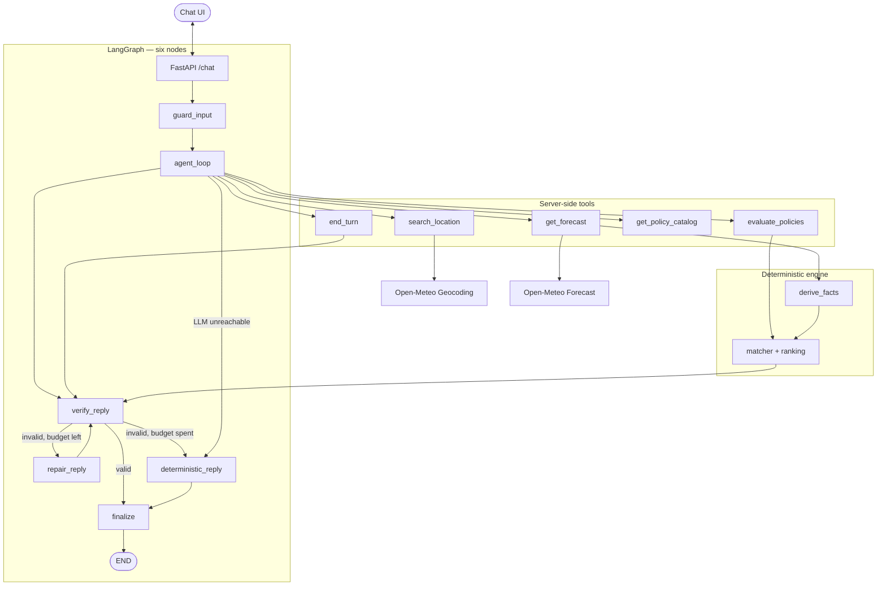

# Architectural Documentation — Weather-Advisory Support Bot

This document describes the implemented architecture of the **SOP-Grounded Weather-Advisory Support Bot**: a Gemini tool-calling agent whose safety advice comes entirely from a deterministic policy engine.

---

## 🏢 System Overview & Core Philosophy

The primary objective is **100% deterministic, policy-grounded outdoor safety advice** using live weather data from Open-Meteo.

### Non-Negotiable Architectural Principles

1. **The LLM Never Decides Policy.** All safety advice originates from Standard Operating Procedures written in YAML in `app/sops/`. The model chooses *parameters*; the engine chooses *policy*.
2. **Zero Code Changes for Policy Updates.** New or revised SOPs are a YAML edit. Thresholds, severity ordering, fact definitions, time windows and agent limits all live in `app/policy_config.yaml`.
3. **Fact Grounding & Verification.** The model never writes weather facts. It receives them from `get_forecast` and passes a server-issued `forecast_ref` to `evaluate_policies`. Every number in the final reply is checked against those facts and the published advice.
4. **Resilience & Honest Fallbacks.** If the model is unreachable, the graph degrades to deterministic advice quoted verbatim from the SOP text. It never invents data to fill the gap.

---

## 📐 Architecture



### Why six nodes

The previous graph had seventeen, split across intent parsing, location resolution, fact derivation and a heuristic structured-output fallback. Almost all of that branching is now the model's job, expressed as tool calls, and the rest is deterministic. What remains is the guard, the loop, the verification gate, one repair, the fallback, and the settle.

### The trust boundary

| Layer | Who controls it | What it guarantees |
|---|---|---|
| `guard_input` | Server | PII redacted, control chars stripped, injection detected |
| `agent_loop` | Model | Chooses which tool to call and with what arguments |
| Tool schemas | Server | Arguments validated by Pydantic before any handler runs |
| `search_location` / `get_forecast` | Server | Mints `location_ref` / `forecast_ref`; the model cannot invent them |
| `evaluate_policies` | Server | Matches YAML SOPs against derived facts; `include_ids` narrows, never widens |
| `verify_reply` | Server | Every cited id must have matched; every number must be supported |
| `deterministic_reply` | Server | Quotes published advice verbatim |

The model is trusted with intent, not with facts or verdicts.

---

## 🔁 The Agent Loop

`app/agent/loop.py` drives a bounded exchange:

1. Build the system prompt from the SOP taxonomy and current config.
2. Send history and the tool declarations to Gemini.
3. For each function call: validate arguments, dispatch, append the result as a `function_response` part.
4. Stop on `end_turn`, on a plain text reply, on `max_steps`, or when a repair turns out to be necessary.

Automatic function calling is **off** (`automatic_function_calling=disabled`). Every tool invocation therefore goes through our validation and dispatch path, and every function response is a part we append ourselves.

### Tools

| Tool | Purpose | Notes |
|---|---|---|
| `search_location` | Resolve a place to coordinates | Returns all candidates with server-minted refs; the model disambiguates |
| `get_forecast` | Fetch conditions and derive facts | Requires a `location_ref` or coordinates; accepts raw coordinates only with the user's own numbers |
| `evaluate_policies` | Match SOPs against a `forecast_ref` | The only source of guidance |
| `get_policy_catalog` | List activities and SOP ids | For when the model cannot map the request to a tag |
| `end_turn` | Report outcome and message | Validated enum; this is how `clarify` / `no_sop` / `out_of_scope` are decided |

### Gemini schema constraints

Gemini rejects `$ref`/`$defs`, `title`, `default` and bare `anyOf` unions in tool declarations. `app/llm/schema_utils.py` inlines refs, drops unsupported keywords and collapses optional-anything unions into `{"type": ..., "nullable": true}`. Bounds are enforced by the Pydantic model and re-clamped from config at dispatch time.

---

## ⚙️ The Deterministic Engine

| Module | Responsibility |
|---|---|
| `engine/fact_registry.py` | The fact contract: name, unit, source, description |
| `engine/timewindow.py` | Resolves `now` / `today` / `tomorrow` / `this_evening` / `custom` to hour ranges from the reference timestamp |
| `engine/facts.py` | Derives facts from raw Open-Meteo output for a window |
| `engine/matcher.py` | SOP matching, with `why` explanations and fuzzy scores |
| `engine/ranking.py` | Orders matches: precedence, then severity, then id |
| `engine/verifier.py` | Grounding and citation checks |
| `engine/policies.py` | Facade used by the tool layer |

### Grounding rules

`verifier.py` builds the set of numbers a reply may contain from:

- values of the derived facts,
- thresholds in the SOPs that actually matched,
- numbers appearing in the cited policies' advice text,
- values interpolated into the rendered advice the model was shown.

Anything else is a violation. SOP ids and clock times are stripped before extraction, so `EXE-WIND-CYCLING-01` is not read as `-1` and "avoid 10:00 to 16:00" does not introduce 10 and 16. There is no blanket constant allowlist; a threshold from a policy that did *not* match is not licensed.

---

## 🛡️ Guardrails

`app/guardrails/` holds YAML-driven rules:

- `patterns.yaml` — PII redaction patterns, injection patterns, control characters, message cap
- `templates.yaml` — every deterministic user-facing string

Redaction happens before the model sees the text. Injection detection sets a flag, adds an instruction to the system prompt, and never permits the message to override the workflow.

---

## 🔁 Outcomes and Routing

`end_turn(outcome, message)` is validated against a fixed enum: `answered`, `no_sop`, `clarify`, `out_of_scope`, `location_failed`, `weather_failed`. Two further outcomes, `llm_unavailable` and `unavailable`, are set by the graph itself and cannot be claimed by the model.

`finalize` only fills gaps: a missing reply is `unavailable`, and an outcome a node already decided is preserved.

---

## 🧪 Testing and Evaluation

- `pytest tests/` — 109 tests, no network. `ScriptedModel` replays a fixed tool-call sequence and resolves `Ref(...)` placeholders against what the dispatcher actually returned, so a script cannot hard-code a server-minted ref.
- `python evals/run_evals.py [live|offline]` — golden scenarios from `evals/cases.yaml`, checking invariants that must hold regardless of the model: citations exist, citations matched, numbers supported, refusals numberless, injection ids absent.

Scenarios that can only be observed when the model calls a tool are marked `requires_model: true` and reported as `SKIP` offline rather than counted as passes.

---

## 📁 Layout

```
app/
  main.py            FastAPI app
  schemas.py         API + domain models
  policy_config.py   typed access to policy_config.yaml
  policy_config.yaml thresholds, severity order, windows, limits
  agent/             schemas, tools, the loop
  llm/               Gemini client, prompt builder, schema inliner
  engine/            facts, matcher, ranking, verifier, policies
  graph/             state, six nodes, routing, builder
  guardrails/        patterns.yaml, templates.yaml
  sops/              published policy YAML
tools/               geocode, weather, sop_loader
evals/               cases.yaml, fixtures, runner, RESULTS.md
tests/               pytest suites
```