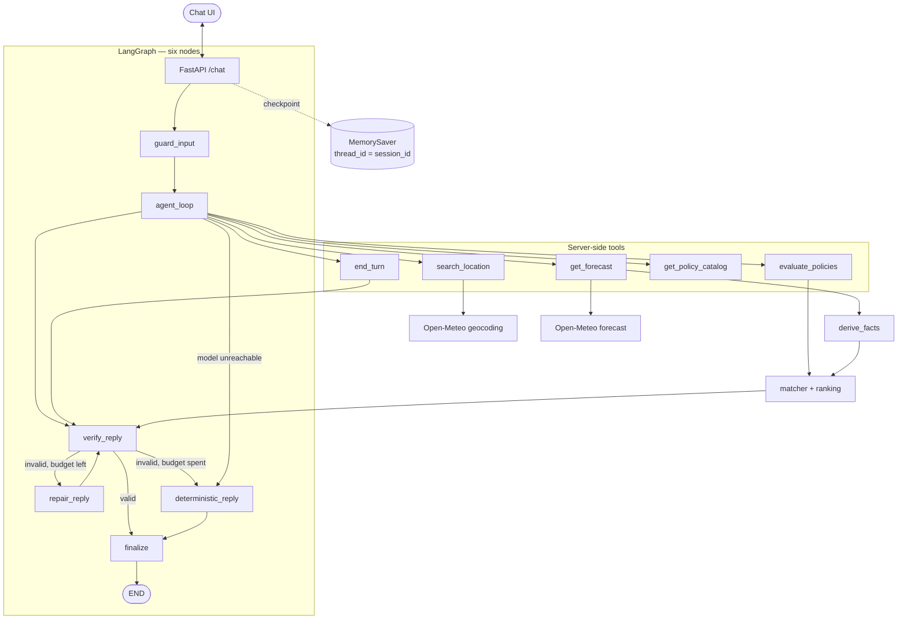

# Architecture — Weather-Advisory Support Bot

Implemented design of the **SOP-Grounded Weather-Advisory Support Bot**: a Gemini tool-calling agent whose safety advice comes entirely from a deterministic policy engine over live Open-Meteo data.

---

## Core philosophy

The objective is **100% deterministic, policy-grounded outdoor safety advice**.

### Non-negotiable principles

1. **The LLM never decides policy.** All safety advice originates from SOP YAML in `app/sops/`. The model chooses *parameters*; the engine chooses *policy*.
2. **A policy change is a YAML edit.** Thresholds, severity ordering, fact definitions, time windows, coordinate bounds, request limits, agent limits and guardrail patterns are all configuration, not code.
3. **Fact grounding and verification.** The model never writes weather facts. It receives them from `get_forecast` and passes a server-issued `forecast_ref` to `evaluate_policies`. Every number in the final reply is checked against those facts and the published advice.
4. **Honest failure.** If the model, the geocoder or the forecaster is unavailable, the reply says so. Nothing is invented to fill a gap.

---

## Architecture



### The six nodes

The graph previously had seventeen, branching across intent parsing, location resolution, fact derivation and a heuristic structured-output fallback. Almost all of that branching is now a model decision expressed as tool calls; the rest is deterministic. What remains:

| Node | Responsibility |
|---|---|
| `guard_input` | Redact PII, strip control characters, detect injection, clip length |
| `agent_loop` | Run the bounded Gemini tool exchange |
| `verify_reply` | Enforce citation and number grounding |
| `repair_reply` | One re-prompt with the verifier's reasons attached |
| `deterministic_reply` | Publish advice verbatim, or report honest failure |
| `finalize` | Settle the outcome, carry session state forward |

`app/graph/routing.py` holds exactly one real decision: did the reply verify, and if not, is there repair budget.

### Trust boundary

| Layer | Controlled by | Guarantees |
|---|---|---|
| `guard_input` | server | PII redacted, injection flagged before the model sees anything |
| `agent_loop` | model | Chooses which tool to call, and with what arguments |
| Tool schemas | server | Arguments validated by Pydantic before any handler runs |
| `search_location` / `get_forecast` | server | Mint `location_ref` / `forecast_ref`; the model cannot invent them |
| `evaluate_policies` | server | Matches YAML SOPs against derived facts; `include_ids` narrows only |
| `verify_reply` | server | Every cited id must have matched; every number must be supported |
| `deterministic_reply` | server | Quotes published advice verbatim |

The model is trusted with intent, never with facts or verdicts.

---

## The agent loop

`app/agent/loop.py` runs a bounded exchange:

1. Build the system prompt from the SOP taxonomy and current config.
2. Send history plus tool declarations to Gemini.
3. For each requested function call: validate arguments, dispatch, append the result as a `function_response` part.
4. Stop on `end_turn`, on a plain text reply, on `max_steps`, or when verification fails.

Automatic function calling is **disabled** (`AutomaticFunctionCallingConfig(disable=True)`), so every invocation passes through our validation and dispatch path and every function response is a part we append ourselves.

Budgets come from `policy_config.yaml` → `agent:` — currently `max_steps: 6`, `verify_repair_attempts: 1`, `max_history_messages: 24`.

### Tools

| Tool | Arguments the model supplies | Returns |
|---|---|---|
| `search_location` | `query`, optional `country_code`, `limit` | ranked candidates, each with a minted `location_ref` |
| `get_forecast` | `location_ref` **or** coordinates, `time_window`, optional `start_time`/`end_time` | `forecast_ref`, derived `facts`, human-readable summary |
| `evaluate_policies` | `forecast_ref`, `activity`, optional `include_ids` | primary and secondary matches with `why` explanations |
| `get_policy_catalog` | optional `category` | activity tags and SOP ids |
| `end_turn` | `outcome`, `message` | halts the loop; sets the outcome |

`get_forecast` falls back to the session's established location when the model omits one, which is what lets "and tomorrow?" resolve without re-asking the city.

### Gemini schema constraints

Gemini rejects `$ref`/`$defs`, `title`, `default` and bare `anyOf` unions in tool declarations. `app/llm/schema_utils.py` inlines refs, drops unsupported keywords, and collapses optional-anything unions into `{"type": ..., "nullable": true}`. It is defensive by design: dangling refs and recursive models degrade to `{"type": "object"}` rather than raising. Bounds are enforced by the Pydantic model *and* re-clamped from config at dispatch time, so a limit is bounded twice by two independent paths.

---

## The deterministic engine

| Module | Responsibility |
|---|---|
| `engine/fact_registry.py` | The fact contract: name, unit, source, description |
| `engine/timewindow.py` | Resolves a window name to hour ranges from a reference timestamp |
| `engine/facts.py` | Derives facts from raw Open-Meteo output for that window |
| `engine/location.py` | Coordinate parsing and bounds validation |
| `engine/matcher.py` | SOP matching, with `why` explanations and fuzzy scores |
| `engine/ranking.py` | Orders matches: precedence, then severity, then id |
| `engine/verifier.py` | Grounding and citation checks |
| `engine/policies.py` | Facade used by the tool layer |

### Facts

Twelve, each declared once in `fact_registry.py`:

`temp_c` (C) · `feels_like_c` (C) · `wind_kmh` (km/h) · `max_gust_kmh` (km/h) · `precip_prob_max` (%) · `precip_window_mm` (mm) · `precip_24h_mm` (mm) · `precip_hours_24h` (h) · `uv_max` · `weather_code_max` · `is_daytime_window` · `has_thunderstorm`

A SOP naming a fact that does not exist is rejected at load time.

### Time windows

Configured in `policy_config.yaml`, not hardcoded: `now`, `today`, `tomorrow`, `this_evening`, `next_24h`, `next_48h`, `custom`. `custom` requires explicit ISO-8601 `start_time` and `end_time`. Each declares `start_hour`, `span_hours` or `day_offset`, and an optional `daytime` override, so `this_evening` is a fixed five-hour block from 18:00 regardless of the reference clock. Daytime itself is 06:00–19:00 (`policy_config.yaml` → `daytime`).

### Grounding rules

`verifier.py` builds the set of numbers a reply may contain from:

- values of the derived facts,
- thresholds in the SOPs that **actually matched**,
- numbers appearing in the cited policies' advice text,
- values interpolated into the rendered advice the model was shown.

Anything else is a violation. SOP ids and clock times are stripped before extraction, so `EXE-WIND-CYCLING-01` is not read as `-1`, and "avoid 10:00 to 16:00" does not introduce 10 and 16. There is deliberately **no blanket constant allowlist** — an earlier version allowlisted 24, 7, 50, 10 and 16 unconditionally, which let a reply assert a humidity of 16% with no support. A threshold belonging to a policy that did not match is not licensed either.

---

## Guardrails

`app/guardrails/` is YAML-driven:

- `patterns.yaml` — PII redaction patterns, injection patterns, allowed control characters, message cap
- `templates.yaml` — every deterministic user-facing string

Redaction happens before the model sees the text. Injection detection sets a flag and adds a refusal instruction to the system prompt; the flagged text is not treated as a request to reason about. Redaction must preserve intent — a message containing a phone number still resolves to an activity and a place.

---

## Outcomes

`end_turn(outcome, message)` is validated against a fixed enum: `answered`, `no_sop`, `clarify`, `out_of_scope`, `location_failed`, `weather_failed`.

Two further outcomes, `llm_unavailable` and `unavailable`, are **not** in the model's enum — the model may not claim it could not do the work. Only the graph sets those. `finalize` preserves any outcome a node already decided and otherwise fills the gaps.

---

## Session state

Carried in a `MemorySaver` checkpoint keyed by `thread_id = session_id`, holding location, activity, time window, facts, refs and the tool trace. Location, activity and window are copied verbatim between turns, which is what lets a follow-up reuse them.

One sharp edge: LangGraph's default msgpack policy is "allow every type, warn once per type", and `with_allowlist()` is a **no-op** against that default. The Pydantic types in state must be passed to the serializer constructor explicitly:

```python
JsonPlusSerializer(allowed_msgpack_modules=[
    ("app.schemas", "LocationModel"),
    ("app.schemas", "SOPModel"),
    ("app.agent.schemas", "ForecastBundle"),
])
```

Otherwise checkpoint round-trips emit warnings today and start failing once LangGraph enforces the policy — silently breaking every follow-up turn.

---

## Testing and evaluation

- **`pytest tests/`** — 109 tests, no network. `ScriptedModel` replays a fixed tool-call sequence; `Ref(...)` placeholders resolve against what the dispatcher actually returned, so a test cannot hard-code a server-minted value. Tool layer, verifier, guardrails, engine, graph and API are each covered.
- **`python evals/run_evals.py [live|offline]`** — 15 golden scenarios. Checks the invariants that must hold regardless of the model: citations exist, citations matched, numbers supported, refusal replies numberless, injection ids absent. Four scenarios are marked `requires_model: true` because they depend on the model issuing a tool call; offline they report `SKIP`, never as passes.

---

## Layout

```
app/
  main.py               FastAPI app: /chat, /health, /sops
  config.py             env and paths
  schemas.py            API and domain models, literal enums
  policy_config.py      typed access to policy_config.yaml
  policy_config.yaml    severity order, facts, windows, bounds, limits
  agent/
    schemas.py          tool arguments, results, TerminalOutcome
    tools.py            tool definitions, handlers, refs, dispatch
    loop.py             the bounded tool exchange
  llm/
    client.py           Gemini: ToolTurn, run_tool_turn, complete_text
    prompts.py          system prompt assembled from taxonomy and config
    schema_utils.py     Gemini-safe JSON schema inliner
  engine/               facts, matcher, ranking, verifier, policies, location, timewindow
  graph/                state, nodes, routing, builder
  guardrails/           patterns.yaml, templates.yaml
  sops/                 published policy YAML
tools/                  geocode, weather, sop_loader
evals/                  cases.yaml, fixtures/, run_evals.py, RESULTS.md
tests/                  pytest suites
```

---

## Current state

Engine, tool layer, guardrails, graph, API and tests are complete and verified offline. The Gemini free-tier quota was exhausted during development (`429 RESOURCE_EXHAUSTED`), so the **live model path has not been exercised end to end** — all verification used a scripted model or the deterministic fallback. Running `python evals/run_evals.py live` is the outstanding step.


by Omkar Gaikwad