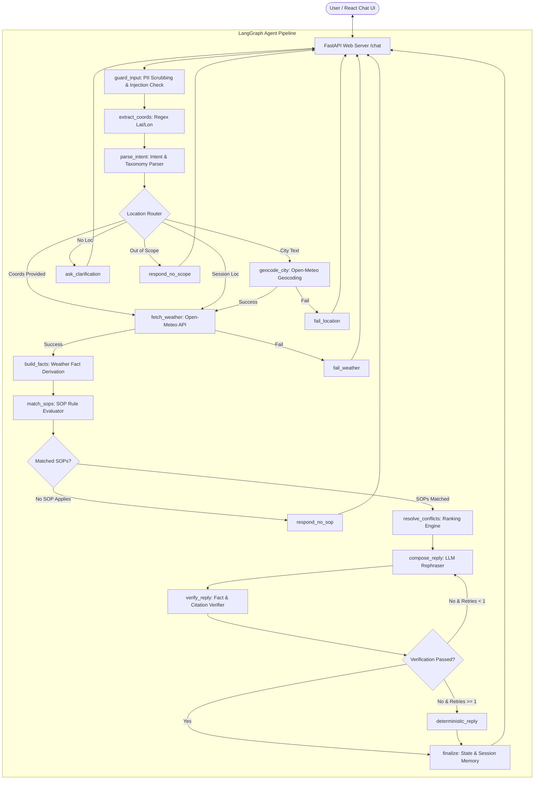

# Architectural Documentation — Weather-Advisory Support Bot

This document provides a comprehensive architectural breakdown of the **SOP-Grounded Weather-Advisory Support Bot**, detailing the design principles, component boundaries, LangGraph agent structure, deterministic rule engine, security guardrails, and data flow.

---

## 🏢 System Overview & Core Philosophy

The primary objective of this system is to deliver **100% deterministic, policy-grounded outdoor safety advice** using live weather data from Open-Meteo.

### Non-Negotiable Architectural Principles:
1. **The LLM Never Decides Policy**: All safety advice originates from Standard Operating Procedures (SOPs) written in YAML files. The LLM only handles natural language rephrasing.
2. **Zero Code Changes for Policy Updates**: Policy maintainers can add, modify, or deprecate SOPs by editing YAML files in `app/sops/` without modifying Python code.
3. **Fact Grounding & Verification**: All numbers reported to the user (temperatures, wind speeds, rainfall totals) are derived directly from the Open-Meteo API. The LLM output is verified before being returned.
4. **Resilience & Honest Fallbacks**: If the location cannot be resolved or the weather API is down, the system fails honestly with a plain message. If the LLM is offline or rate-limited, the system seamlessly degrades to deterministic raw SOP advice templates.

---

## 📐 System Architecture Diagram



---

## 🤖 LangGraph Agent Architecture

The agent is implemented as a stateful graph (`StateGraph`) using **LangGraph** with real conditional branching and session persistence via `MemorySaver`.

### Graph State Schema (`GraphState`)
The agent state is passed across nodes as a typed dictionary containing:
- `session_id`: Unique chat session identifier.
- `message` & `sanitized_message`: Original and sanitized user input.
- `injection_flag`: Boolean flag indicating detected prompt injection attempts.
- `coords_candidate`: Optional tuple of parsed `(latitude, longitude)`.
- `intent`: `IntentParseResult` Pydantic model (`intent_type`, `activity`, `city_text`, `time_ref`).
- `location`: Resolved `LocationModel` (`lat`, `lon`, `label`, `source`).
- `raw_weather` & `facts`: API weather payload and derived numerical facts dictionary.
- `matched_sops`: List of matched SOP objects and rendered advice.
- `ranking_result`: Primary SOP, secondary SOPs, and combined advice string.
- `reply`: Generated reply text.
- `verify_passed` & `verify_retries`: Verification status and retry counter.
- `outcome`: Terminal outcome state (`answered`, `no_sop`, `location_failed`, `weather_failed`, `clarify`, `out_of_scope`).

---

## 🧩 Comprehensive Node Breakdown (17 Graph Nodes)

| # | Node Name | Category | Primary Function |
|---|---|---|---|
| 1 | `guard_input` | Security Middleware | Strips control characters, scrubs PII (emails, phone numbers, IDs), and scans for jailbreaks/prompt injections. |
| 2 | `extract_coords` | Deterministic Entity Extraction | Uses regex to extract coordinates (`18.616, 74.698`) in 0.01ms with 100% precision. |
| 3 | `parse_intent` | Intent & Entity Parsing | Calls Gemini API (or keyword fallback) to classify intent type, activity, city, and time window. Handles multi-turn follow-ups. |
| 4 | `geocode_city_node` | Geocoding Tool | Calls Open-Meteo Geocoding API to resolve city text into `(lat, lon)`. |
| 5 | `fetch_weather` | Weather Tool | Calls Open-Meteo Forecast API for target coordinates. Includes retry logic and error catching. |
| 6 | `build_facts` | Fact Engine | Derives window-specific weather facts (`temp_c`, `wind_kmh`, `uv_max`, `precip_window_mm`, `has_thunderstorm`) from raw weather payload. |
| 7 | `match_sops_node` | Rule Evaluator | Evaluates all loaded SOP YAML rules against the user activity and derived facts. Supports boolean logic (`when`) and fuzzy scoring (`scoring`). |
| 8 | `resolve_conflicts_node` | Conflict Resolver | Ranks matched SOPs deterministically by Precedence (`override` first) $\rightarrow$ Severity $\rightarrow$ Tie-break. |
| 9 | `compose_reply` | LLM Rephraser | Invokes Gemini API to rephrase official SOP advice into a friendly response, strictly constrained to cite SOP IDs and use only real numbers. |
| 10 | `verify_reply_node` | Verifier & Self-Correction | Verifies that all numbers in the reply match API facts/SOP bounds and that cited SOP IDs are valid. |
| 11 | `deterministic_reply` | Safe Fallback | Generates a 100% deterministic response from raw SOP templates if LLM rephrasing fails verification twice. |
| 12 | `respond_no_scope` | Terminal Handler | Handles greetings and out-of-scope questions with a polite refusal. |
| 13 | `ask_clarification` | Terminal Handler | Prompts user for a location when none is provided in message or session memory. |
| 14 | `respond_no_sop` | Terminal Handler | Responds honestly when weather is retrieved but no SOP rules apply. |
| 15 | `fail_location` | Terminal Handler | Responds honestly when geocoding fails to resolve a city name. |
| 16 | `fail_weather` | Terminal Handler | Responds honestly when the Open-Meteo API is unreachable or fails. |
| 17 | `finalize` | State & Memory | Finalizes outcome payload and saves location & activity into `MemorySaver` for multi-turn session persistence. |

---

## 🔄 Self-Correction & Verification Loop

The agent includes a feedback loop between `compose_reply` and `verify_reply`:

```
                 ┌──────────────────┐
                 │  compose_reply   │◄───────────┐
                 └────────┬─────────┘            │
                          │                      │
                          ▼                      │ (Verification failed & retries < 1)
                 ┌──────────────────┐            │
                 │   verify_reply   ├────────────┘
                 └────────┬─────────┘
                          │
         ┌────────────────┴────────────────┐
         ▼                                 ▼
 (verify_passed == True)          (verify_retries >= 1)
     finalize ──► END            deterministic_reply ──► END
```

1. **Fact & Citation Check**: `verify_reply` parses all numbers and SOP IDs in the LLM's generated reply using regex.
2. **Re-prompting Loop**: If the LLM hallucinated a number or omitted an SOP citation, `route_after_verify` loops back to `compose_reply` for a re-prompt attempt.
3. **Guaranteed Termination**: If verification fails a second time, the graph breaks out to `deterministic_reply`, ensuring zero hallucinations and guaranteed response delivery.

---

## 🛡️ Security & Privacy Layer

1. **PII Scrubbing**: `_scrub_pii()` in `guard_input` automatically detects and redacts:
   - Email addresses $\rightarrow$ `[EMAIL_REDACTED]`
   - Phone numbers $\rightarrow$ `[PHONE_REDACTED]`
   - Credit Card / Aadhaar / SSN $\rightarrow$ `[SENSITIVE_ID_REDACTED]`
2. **Prompt Injection Defense**: `INJECTION_PATTERNS` scans for jailbreak attempts (`developer mode`, `override sops`, `system prompt`, `<|im_start|>`) and flags them in the state.

---

## 📊 Conflict Resolution & Ranking Engine

When multiple SOPs match a query (e.g. high wind and high UV for cycling), `resolve_conflicts` ranks them using a deterministic 3-tier hierarchy:

1. **Precedence**: `precedence: "override"` (e.g. severe rain/cyclone system) always takes priority over standard activity SOPs.
2. **Severity Weight**:
   - `critical` $\rightarrow$ Weight 5
   - `high` $\rightarrow$ Weight 4
   - `moderate` $\rightarrow$ Weight 3
   - `low` $\rightarrow$ Weight 2
   - `info` $\rightarrow$ Weight 1
3. **Tie-Breaker**: Alphabetical sorting by SOP ID.

The top-ranked SOP becomes the **Primary SOP**, and up to two additional SOPs are included as **Secondary SOPs**.

---

## 🛠️ Technology Stack & Dependencies

- **Backend**: FastAPI, Python 3.11+, Pydantic v2
- **Agent Framework**: LangGraph with `MemorySaver`
- **LLM Engine**: Official `google-genai` SDK with `GEMINI_API_KEY` (direct API integration, no gateway)
- **Live APIs**: Open-Meteo Forecast & Open-Meteo Geocoding APIs (via `httpx`)
- **Frontend**: React + Vite, Lucide Icons, Vanilla CSS Glassmorphism
